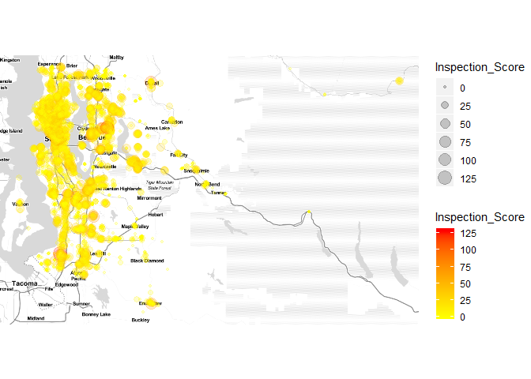
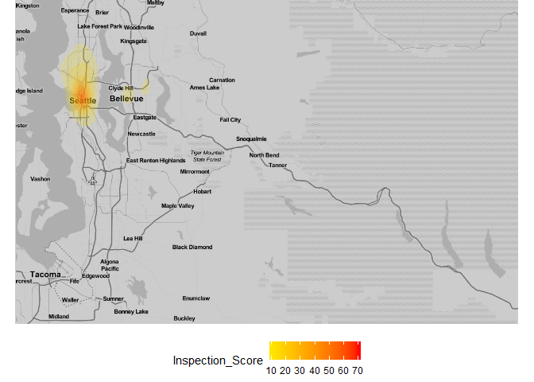
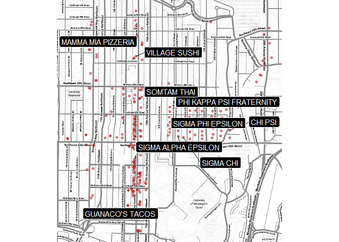
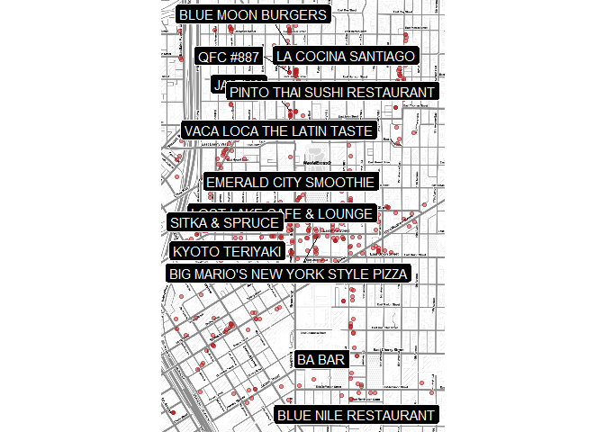
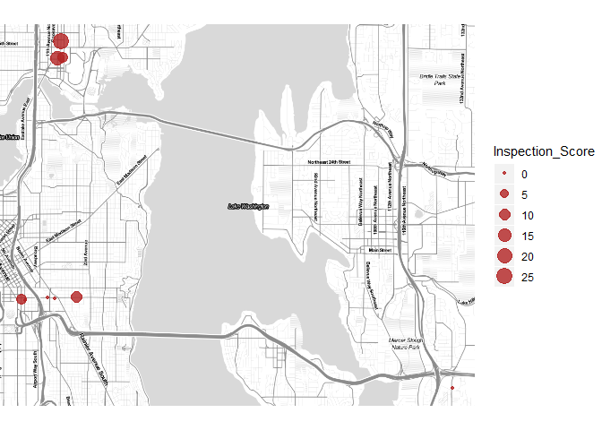
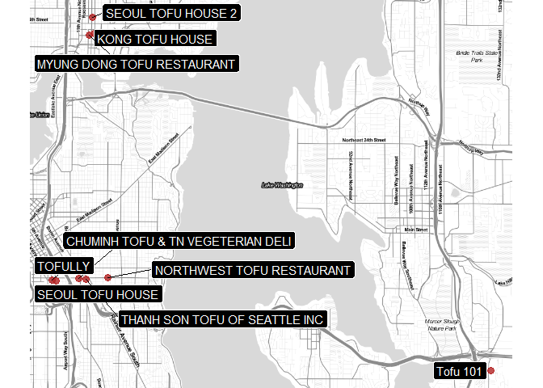
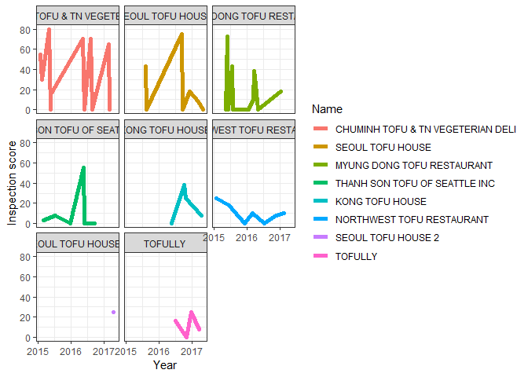

# Instructions

> Fill in this lab worksheet at your own pace. Knit it periodically to check that things are working the same way they are when you are working in RStudio interactively. Ask questions, consult with others, use Google, etc. At the end of the class session, email what you have to yourself so you don't lose progress. You do not need to turn in your work, but feedback will probided if you as Homework 7 on Canvas (both Rmd and HTML files). These will be evaluated by Chuck rather than peer reviewed.

You will probably want to have the following libraries loaded (you can add more in if needed):


# Background

> Last week we saw data from health inspections of restaurants in Seattle since 2012 and used them to practice working with character/string data and regular expressions. Load in the data directly from the URL (this will work because a CSV is just a text file) and use `cache=TRUE` so that we don't have to repeat this each time we re-knit:


```r
restaurants <- read_csv("https://clanfear.github.io/CSSS508/Lectures/Week8/restaurants.csv",  col_types = "ccccccccnnccicccciccciD")
```

> As a reminder of what these data look like:


```r
str(restaurants)
```

```
## Classes 'tbl_df', 'tbl' and 'data.frame':	258630 obs. of  23 variables:
##  $ Name                      : chr  "@ THE SHACK, LLC" "10 MERCER RESTAURANT" "10 MERCER RESTAURANT" "10 MERCER RESTAURANT" ...
##  $ Program_Identifier        : chr  "SHACK COFFEE" "10 MERCER RESTAURANT" "10 MERCER RESTAURANT" "10 MERCER RESTAURANT" ...
##  $ Inspection_Date           : chr  NA "01/24/2017" "01/24/2017" "01/24/2017" ...
##  $ Description               : chr  "Seating 0-12 - Risk Category I" "Seating 13-50 - Risk Category III" "Seating 13-50 - Risk Category III" "Seating 13-50 - Risk Category III" ...
##  $ Address                   : chr  "2920 SW AVALON WAY" "10 MERCER ST" "10 MERCER ST" "10 MERCER ST" ...
##  $ City                      : chr  "Seattle" "Seattle" "Seattle" "Seattle" ...
##  $ Zip_Code                  : chr  "98126" "98109" "98109" "98109" ...
##  $ Phone                     : chr  "(206) 938-5665" NA NA NA ...
##  $ Longitude                 : num  -122 -122 -122 -122 -122 ...
##  $ Latitude                  : num  47.6 47.6 47.6 47.6 47.6 ...
##  $ Inspection_Business_Name  : chr  NA "10 MERCER RESTAURANT" "10 MERCER RESTAURANT" "10 MERCER RESTAURANT" ...
##  $ Inspection_Type           : chr  NA "Routine Inspection/Field Review" "Routine Inspection/Field Review" "Routine Inspection/Field Review" ...
##  $ Inspection_Score          : int  NA 10 10 10 15 15 15 0 15 15 ...
##  $ Inspection_Result         : chr  NA "Unsatisfactory" "Unsatisfactory" "Unsatisfactory" ...
##  $ Inspection_Closed_Business: chr  NA "false" "false" "false" ...
##  $ Violation_Type            : chr  NA "blue" "blue" "red" ...
##  $ Violation_Description     : chr  NA "4300 - Non-food contact surfaces maintained and clean" "4800 - Physical facilities properly installed,..." "1200 - Proper shellstock ID; wild mushroom ID;  parasite destruction procedures for fish" ...
##  $ Violation_Points          : int  0 3 2 5 5 5 5 0 5 10 ...
##  $ Business_ID               : chr  "PR0048053" "PR0049572" "PR0049572" "PR0049572" ...
##  $ Inspection_Serial_Num     : chr  NA "DAHSIBSJT" "DAHSIBSJT" "DAHSIBSJT" ...
##  $ Violation_Record_ID       : chr  NA "IV43WZVLN" "IVCQ1ZIV0" "IVREK90PM" ...
##  $ Grade                     : int  NA 2 2 2 2 2 2 2 2 2 ...
##  $ Date                      : Date, format: NA "2017-01-24" ...
##  - attr(*, "spec")=
##   .. cols(
##   ..   Name = col_character(),
##   ..   Program_Identifier = col_character(),
##   ..   Inspection_Date = col_character(),
##   ..   Description = col_character(),
##   ..   Address = col_character(),
##   ..   City = col_character(),
##   ..   Zip_Code = col_character(),
##   ..   Phone = col_character(),
##   ..   Longitude = col_number(),
##   ..   Latitude = col_number(),
##   ..   Inspection_Business_Name = col_character(),
##   ..   Inspection_Type = col_character(),
##   ..   Inspection_Score = col_integer(),
##   ..   Inspection_Result = col_character(),
##   ..   Inspection_Closed_Business = col_character(),
##   ..   Violation_Type = col_character(),
##   ..   Violation_Description = col_character(),
##   ..   Violation_Points = col_integer(),
##   ..   Business_ID = col_character(),
##   ..   Inspection_Serial_Num = col_character(),
##   ..   Violation_Record_ID = col_character(),
##   ..   Grade = col_integer(),
##   ..   Date = col_date(format = "")
##   .. )
```

> There are often multiple rows per `Business_ID` per `Date`, such as when an establishment is given violation points for multiple problems. The `Result` and `Score` columns will have the same values on those rows for the same restaurant and date, but details of the violation type ("red" or "blue"), violation description, and violation points will differ from row to row, with different violations on different rows. Keep this duplication in mind as you work. You will need to drop extra rows to get one row per business per date, or even one row per business. You can do this using the `dplyr` concepts we've studied like the `distinct()` function, or `group_by()` and `summarize()` or `filter()` to collapse over multiple rows.


# Preparing the data

## Restaurants only

> There are grocery stores without seating, school cafeterias, and other less relevant businesses in the data. We only want to look at restaurants. Identify and only keep businesses whose `Description` *starts with* `Seating`, e.g. `"Seating 51-150 - Risk Category III"`. Call this new data frame with the rows filtered `restaurants_only`.


```r
restaurants_only <- restaurants %>% 
  filter(str_detect(Description, "Seating"))
```


## Scores over time

> Now make a data frame using `restaurants_only` called `scores_over_time` with exactly one row per `Business_ID` per inspection `Date`, with the business `Name`, its `Address` and `ZIP`, its `Longitude` and `Latitude`, and the value of `Score` on each inspection date. With data structured this way, you will be able analyze trends over time for each establishment. There should no longer be duplicate rows for when an establishment has multiple violations on a single date.


```r
scores_over_time <- restaurants_only %>% 
  group_by(Business_ID, Date) %>% 
  distinct(Name, Address, Zip_Code, Longitude, Latitude, Inspection_Score)

head(scores_over_time)
```

```
## # A tibble: 6 x 8
## # Groups:   Business_ID, Date [6]
##   Name  Address Zip_Code Longitude Latitude Inspection_Score Business_ID
##   <chr> <chr>   <chr>        <dbl>    <dbl>            <int> <chr>      
## 1 @ TH~ 2920 S~ 98126        -122.     47.6               NA PR0048053  
## 2 10 M~ 10 MER~ 98109        -122.     47.6               10 PR0049572  
## 3 10 M~ 10 MER~ 98109        -122.     47.6               15 PR0049572  
## 4 10 M~ 10 MER~ 98109        -122.     47.6                0 PR0049572  
## 5 10 M~ 10 MER~ 98109        -122.     47.6               15 PR0049572  
## 6 10 M~ 10 MER~ 98109        -122.     47.6               25 PR0049572  
## # ... with 1 more variable: Date <date>
```


## Preparing to label bad scores

> In order to label restaurants with bad scores (say, 40 and above), you'll want to make a column called `Label_40` on `scores_over_time`. It should have the `Name` if the `Score` is greater than or equal to 40, and be blank (i.e. `""`) if the `Score` is below that. Use `mutate` and `ifelse` to make this `Label_40` column.


```r
scores_over_time <- scores_over_time %>% 
  mutate(Label_40 = ifelse(Inspection_Score >= 40, Name, "")) %>% 
  filter(!is.na(Longitude))

head(scores_over_time)
```

```
## # A tibble: 6 x 9
## # Groups:   Business_ID, Date [6]
##   Name  Address Zip_Code Longitude Latitude Inspection_Score Business_ID
##   <chr> <chr>   <chr>        <dbl>    <dbl>            <int> <chr>      
## 1 @ TH~ 2920 S~ 98126        -122.     47.6               NA PR0048053  
## 2 10 M~ 10 MER~ 98109        -122.     47.6               10 PR0049572  
## 3 10 M~ 10 MER~ 98109        -122.     47.6               15 PR0049572  
## 4 10 M~ 10 MER~ 98109        -122.     47.6                0 PR0049572  
## 5 10 M~ 10 MER~ 98109        -122.     47.6               15 PR0049572  
## 6 10 M~ 10 MER~ 98109        -122.     47.6               25 PR0049572  
## # ... with 2 more variables: Date <date>, Label_40 <chr>
```


## Most recent scores

> We'll also want to look at just the most recent scores for each restaurant. Make a data frame called `recent_scores` from `scores_over_time` that has one row per `Business_ID`, with the business `Name`, its `Address` and `ZIP`, `Longitude` and `Latitude`, the most recent value of `Score`, the `Date` of that score, and `Label_40`. The slides from last week pertaining to looking at the most recent inspections of coffee shops have code that might help.


```r
recent_scores <- scores_over_time %>% 
  group_by(Business_ID) %>% 
  filter(Date == max(Date)) %>% 
  filter(Inspection_Score == max(Inspection_Score)) 

head(recent_scores)
```

```
## # A tibble: 6 x 9
## # Groups:   Business_ID [6]
##   Name  Address Zip_Code Longitude Latitude Inspection_Score Business_ID
##   <chr> <chr>   <chr>        <dbl>    <dbl>            <int> <chr>      
## 1 10 M~ 10 MER~ 98109        -122.     47.6               10 PR0049572  
## 2 100 ~ 1001 F~ 98109        -122.     47.6                0 PR0085848  
## 3 1000~ 1225 1~ 98101        -122.     47.6                0 PR0082813  
## 4 108 ~ 18114 ~ 98032        -122.     47.4               15 PR0071992  
## 5 112T~ 1120 1~ 98004        -122.     47.6               10 PR0066560  
## 6 11TH~ 7638 N~ 98028        -122.     47.8                0 PR0006149  
## # ... with 2 more variables: Date <date>, Label_40 <chr>
```


# Map-making

# Mapping the recent scores

> Now, use the `ggmap` package and the longitude and latitude information to plot the most recent inspection scores for restaurants on top of a map of Seattle. Experiment with zoom levels to get the right region bounds. Try coloring and/or sizing the points according to their most recent inspection score (bigger points = higher score). You can use [`scale_color_gradient`](http://docs.ggplot2.org/current/scale_gradient.html) to set the colors so that establishments with lower scores are white or gray, and establishments with higher scores are red, and [`scale_size`](http://docs.ggplot2.org/current/scale_size.html) to set the sizes. Play with these options and map settings until you get something you think looks good.


```r
qmplot(data = recent_scores, 
       x = Longitude, 
       y = Latitude, 
       maptype = "toner-lite",
       color = Inspection_Score, 
       size = Inspection_Score,
       alpha = I(0.2))+
  scale_color_gradient2(
    "Inspection_Score", 
    low = "white", 
    mid = "yellow", 
    high = "red")
```

<!-- -->

```r
qmplot(data = recent_scores, geom = "blank",
       x = Longitude, y = Latitude, 
       maptype = "toner-lite", 
       darken = 0.2) + 
  stat_density_2d(
    aes(fill = stat(level)),
    geom = "polygon", 
    alpha = .2, color = NA) + 
  scale_fill_gradient2(
    "Inspection_Score", 
    low = "white", 
    mid = "yellow", 
    high = "red") + 
  theme(legend.position = "bottom")
```

<!-- -->


## The U District

> Now repeat the plot, but zoomed in on the U District area. Add some text labels using `Label_40` for businesses whose scores were 40 or higher on their most recent inspection. See the [`ggplot2` docs on `geom_text()` and `geom_label()`](http://docs.ggplot2.org/current/geom_text.html) for how you can get these to look good, perhaps trying out the [`ggrepel` package](https://cran.r-project.org/web/packages/ggrepel/vignettes/ggrepel.html) to avoid overlaps.


```r
udist <- recent_scores %>%
  filter(Latitude > 47.655, Latitude < 47.67,
         Longitude > -122.32, Longitude < -122.30)

qmplot(data = udist,
       x = Longitude,
       y = Latitude,
       maptype = "toner-lite", 
       color = I("firebrick"), 
       alpha = I(0.5)) + 
  geom_label_repel(
    data = udist,
    aes(label = Label_40), 
    fill = "black", 
    color = "white", 
    segment.color = "black")
```

<!-- -->


## Capitol Hill

> Repeat the above, but for Capitol Hill instead.


```r
caphill <- recent_scores %>%
  filter(Latitude > 47.605, Latitude < 47.625,
         Longitude > -122.33, Longitude < -122.31)

qmplot(data = caphill,
       x = Longitude,
       y = Latitude,
       maptype = "toner-lite", 
       color = I("firebrick"), 
       alpha = I(0.5)) + 
  geom_label_repel(
    data = caphill,
    aes(label = Label_40), 
    fill = "black", 
    color = "white", 
    segment.color = "black")
```

<!-- -->


# Scores over time


## Sub-sampling the data

> Now we want to look at inspection scores over time for restaurants, but there are far too many to visualize. Pick something more limited to investigate and subset the `scores_over_time` data to include somewhere between around 5 and 25 establishments. To do this, you'll want to make a vector that has just the `Business_ID` or `Name` values of restaurants of interest, and then `filter()` the `scores_over_time()` data based on this. Some examples of angles you could choose for doing this subsetting:

> * Restaurants in your ZIP code
> * Your favorite chain restaurant
> * Diners
> * Coffee shops in a part of the city
> * A cuisine based on words in restaurant names (e.g. "Pho")
> * Restaurants that have had a really bad score at some time -- did they have previous bad scores, or were they mostly without problems before? 

> The string pattern matching tools from last week could be helpful depending on the criteria you choose.


```r
tofu <- scores_over_time %>% 
  filter(str_detect(Name, "TOFU|Tofu|tofu")) %>% 
  filter(Latitude > 47.57, Latitude < 47.70,
         Longitude > -122.39, Longitude < -122.14)
```


## Mapping your subsample

> Make a plot, appropriately cropped, showing the locations of the restaurants you've chosen with a dot for each restaurant and text labels.


```r
tofu_point <- tofu %>% 
  group_by(Business_ID) %>% 
  filter(Date == max(Date)) %>% 
  filter(Inspection_Score == max(Inspection_Score)) 

qmplot(data = tofu_point,
       x = Longitude,
       y = Latitude,
       maptype = "toner-lite", 
       color = I("firebrick"), 
       size = Inspection_Score,
       alpha = I(0.8))
```

<!-- -->

```r
qmplot(data = tofu_point,
       x = Longitude,
       y = Latitude,
       maptype = "toner-lite", 
       color = I("firebrick"), 
       size = I(3),
       alpha = I(0.8)) + 
  geom_label_repel(
    data = tofu_point,
    aes(label = Name), 
    fill = "black", 
    color = "white", 
    segment.color = "black")
```

<!-- -->


## Plotting time trends

> Now make a longitudinal plot! You should use `facet_wrap()` by restaurant name so that you have one panel per restaurant. The x axis should be the `Date` (maybe reformatted using [`scale_x_date`](http://docs.ggplot2.org/current/scale_date.html) to avoid extra clutter) and the y axis should be the `Score`. Use a `geom_line` layer to show the trend in scores for each restaurant. Do you observe anything interesting about the scores for the restaurants you've chosen? (This doesn't involve any new skills, just a refresher on `ggplot2` practice!)


```r
tofu <- tofu %>% 
  filter(Longitude < -122.24, Date > as.Date("2015-01-01")) 

tofu_arr <- tofu %>% 
  group_by(Name) %>% 
  summarise(high = max(Inspection_Score)) %>% 
  arrange(desc(high))

tofu %>% 
  mutate(Name = parse_factor(Name, levels = tofu_arr$Name)) %>% 
  ggplot(aes(x = Date, y = Inspection_Score, group = Name, color = Name)) +
  facet_wrap( ~ Name) +
  geom_point() +
  geom_line(size = 2) +
  xlab("Year") + ylab("Inspection score") +
  theme_bw() +
  scale_x_date(date_breaks = "1 year", date_labels = "%Y")
```

<!-- -->

